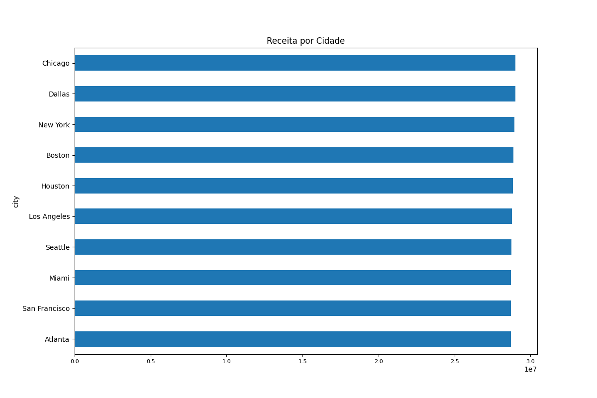
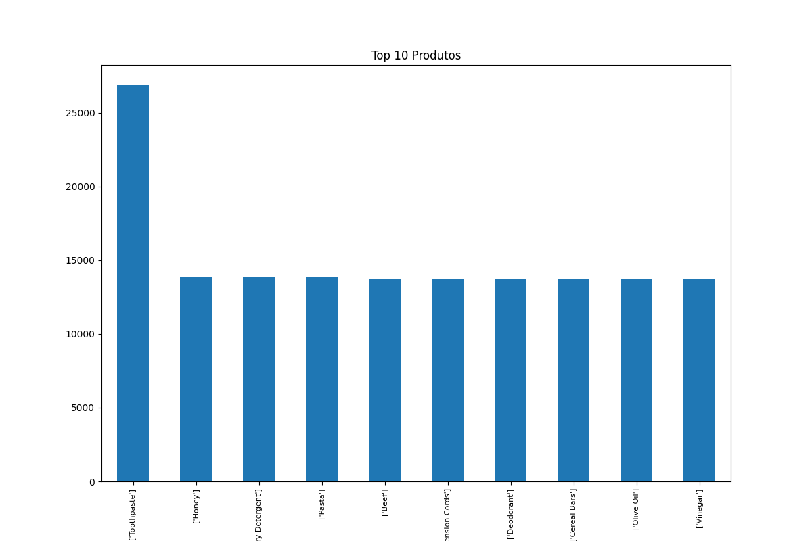
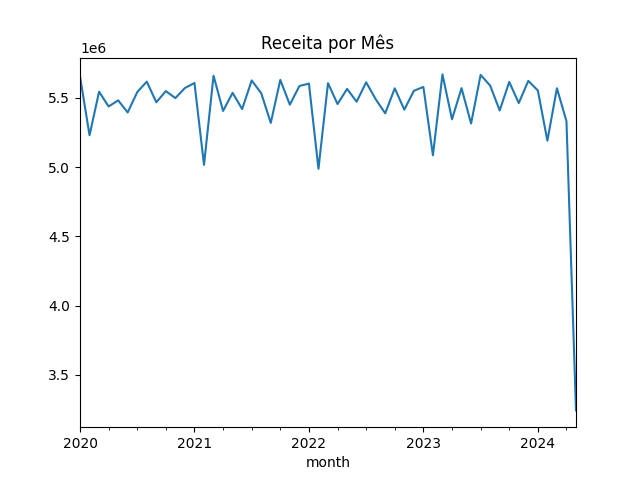
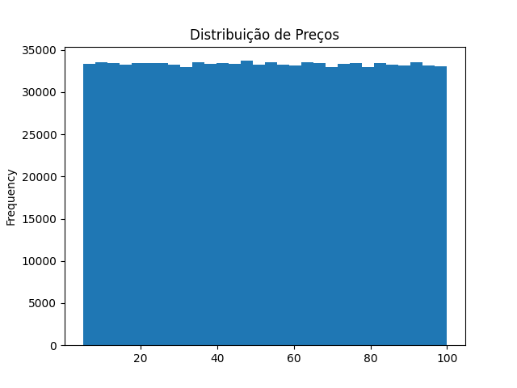
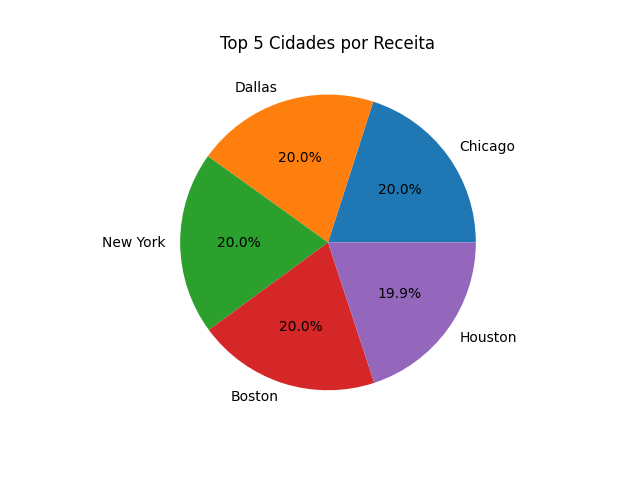
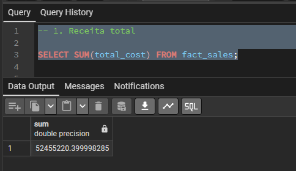
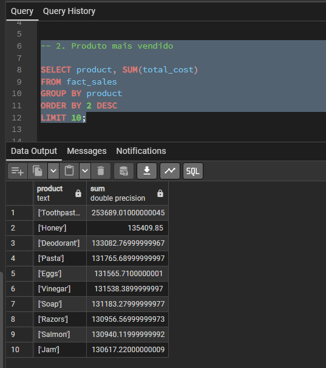
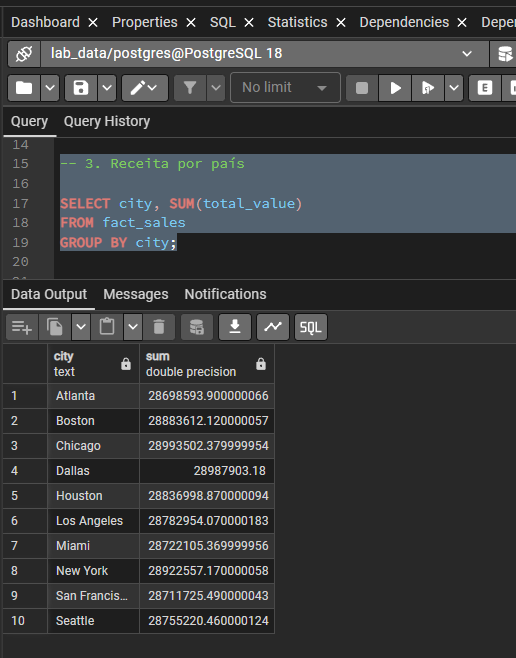
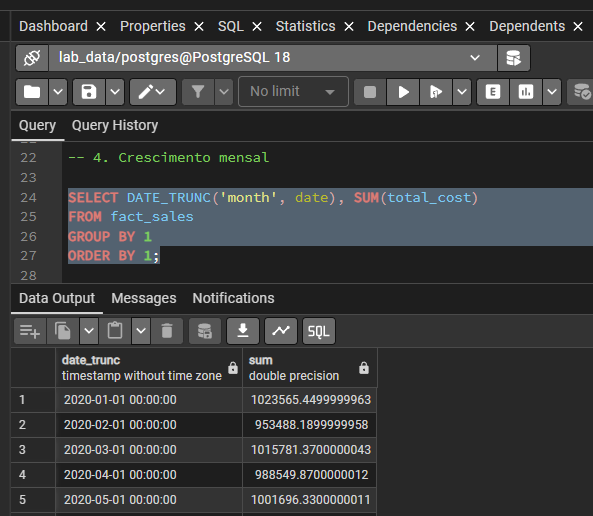
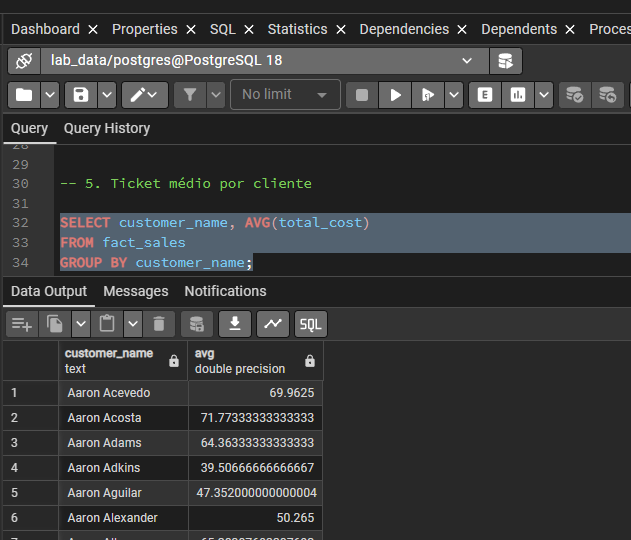

# Lab01_PART1_NUSP_18105793

# LABORATÓRIO 01-A: Ingestão de Dados End-to-End (Local) 

# Fernando Luiz Gomes - NUSP 18105793

**Disciplina:** Fundamentos de Engenharia de Dados  

## Objetivo

Este laboratório tem como propósito a construção de um Pipeline (Engenharia de Dados), com a arquitetura em camadas: Raw, Bronze, Silver e Gold, com objetivo na ingestão, tratamento e preparo dos dados de transações do varejo (análise de cesta de compras, segmentação de clientes e análise de varejo).

Link GitHub >> https://github.com/flg29-data/Lab01_PART1_18105793

## DATASET

- **Nome:** Brazilian E-Commerce Public Dataset (Olist)
- **Fonte:** Kaggle
- **Dataset:** Retail Transactions Dataset
- **Arquivo Utilizado:** Retail_Transactions_Dataset.csv
- **Volume:** 1.000.000 registros e 13 colunas 

## Conteúdo

## 1. Arquitetura

Construção do Pipeline

```
→ CSV (Kaggle) - 1M Registros
  - Importação Carga >> Arquivo: Retail_Transactions_Dataset.csv

→ Python (versão 3.14.3)
  - Instalação bibliotecas >> pip install pandas sqlalchemy psycopg2-binary

→ Parquet
  - Instalação >> ppip install fastparquet

→ Gráficos Python
  - Instalação Biblioteca >> pip install matplotlib

→ PostgreSQL (versão 18.3)
  - Instalação >> configuração da Porta 5432 >> pgAdmin
  - Configuração Database >> CREATE DATABASE lab_data;
```

## 2. Documentação da tarefa

### 2.1 Camada Raw

Salvar o dataset sem nenhuma transformação, mantendo os dados no formato original

→ python no script >> `scripts/ingest_raw.py`

**RESULTADO**


### 2.2 Camada Silver

#### 2.2.1 Tratamento dos dados:

Dados tratados (padronização campos, datas, métricas, nulos e duplicados)
Criação do arquivo PARQUET

→ python no script >> `scripts/transform_silver.py`

**RESULTADO**


#### 2.2.2 Construção dos gráficos:

Instalação da biblioteca >>  ```pip install matplotlib```
→ python no script >> `scripts/graficos.py`

## GRÁFICOS GERADOS 

### 1. Receita por país


### 2. Top produtos


### 3. Receita por mês


### 4. Distribuição de preços


### 5. Ticket médio por cliente


### 2.3 Camada Gold

#### 2.3.1 Modelagem no PostgreSQL

Criação das Tabelas
1 Fato (fact_sales)
3 Dimensões (dim_product, dim_customer, dim_date)

→ query SQL >> `sql/create_tables.sql`

**RESULTADO**


#### 2.3.2 Definição das Metricas de negócio (dados de transações do varejo)

→ query SQL >> `sql/queries.sql`

#### 2.3.3 Carregamento dos dados PARQUET para PostgreSQL via Python

→ python no script >> `scripts/load_gold.py`

**RESULTADO**


## CONSULTAS GERADAS

### 1. Receita Total
**RESULTADO**



### 2. Produto mais vendido
**RESULTADO**



### 3. Receita por país
**RESULTADO**



### 4. Crescimento mensal
**RESULTADO**



### 5. Ticket médio por cliente
**RESULTADO**




## 3. Dicionário de Dados

Dicionário de dados construído >> Silver

| Coluna                   | Tipo      | Descrição |
|--------------------------|----------|----------|
| transaction_id             | bigint  | Campo Id transação - tabela fato vendas |
| date             | timestamp  | Campo data - tabela fato vendas |
| customer_name            | text  | Campo nome cliente - tabela fato vendas |
| product             | text  | Campo nome cliente - tabela fato vendas |
| total_itens             | bigint  | Campo nome cliente - tabela fato vendas |
| total_cost             | double precision  | Campo nome cliente - tabela fato vendas |
| payment_method             | text  | Campo nome cliente - tabela fato vendas |
| city             | text  | Índice do registro da tabela fato vendas |
| store_type             | text  | Índice do registro da tabela fato vendas |
| discount_applied             | boolean  | Índice do registro da tabela fato vendas |
| customer_applied             | boolean  | Índice do registro da tabela fato vendas |
| season             | text  | Índice do registro da tabela fato vendas |
| promotion             | text  | Índice do registro da tabela fato vendas |
| total_value             | double precision  | Índice do registro da tabela fato vendas |
| transaction_id             | Bigint  | Índice do registro da tabela fato vendas |
| transaction_id             | Bigint  | Índice do registro da tabela fato vendas |
| transaction_id             | Bigint  | Índice do registro da tabela fato vendas |
| transaction_id             | Bigint  | Índice do registro da tabela fato vendas |
| transaction_id             | Bigint  | Índice do registro da tabela fato vendas |
| transaction_id             | Bigint  | Índice do registro da tabela fato vendas |

Dicionário de dados construído >> Gold

## 4. Qualidade de Dados

Tratamentos realizados (Camada Silver)

- padronização dos nomes das colunas
- conversão dos dados
- criação de métricas
- tratamento de nulos
- remover valores inválidos
- remover valores duplicados

## 5. Instruções de Execução

Execução realizada:

```
pip install -r requirements.txt

python scripts/ingest_raw.py
python scripts/transform_silver.py
python scripts/load_gold.py
```
